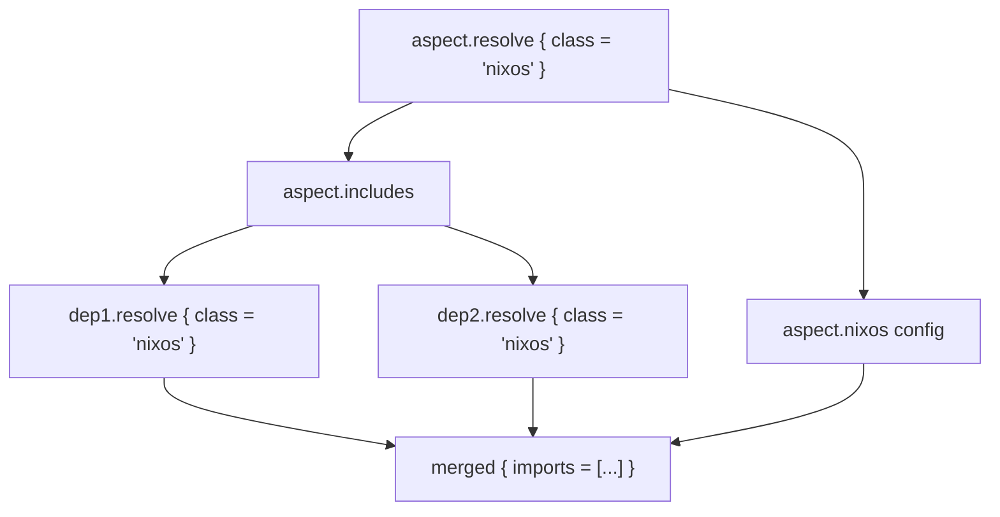

import { Aside } from '@astrojs/starlight/components';

## Aspect structure

Each aspect is a Nix submodule ([`nix/types.nix`](https://github.com/vic/flake-aspects/blob/main/nix/types.nix)) with:

| Attribute | Type | Purpose |
|---|---|---|
| `name` | `str` | Auto-set to the attribute name |
| `description` | `str` | Human-readable description |
| `<class>` | `deferredModule` | Freeform: any key not in this table is a class-specific config |
| `includes` | `listOf providerType` | Dependencies on other aspects |
| `provides` / `_` | `submodule` | Nested sub-aspects (see [Providers](/concepts/providers/)) |
| `__functor` | `function` | Override resolution behavior (see [Functor guide](/guides/functor/)) |
| `resolve` | internal | `{ class, aspect-chain? } → module` |
| `modules` | internal | `<class> → resolved-module` (lazy attrset) |

An aspect is simultaneously an attribute set (with class configs) and callable (via `__functor`).

## Defining aspects

```nix
flake.aspects = {
  my-desktop = {
    nixos  = { services.xserver.enable = true; };
    darwin = { services.yabai.enable = true; };
  };
};
```

Each key under the aspect that is not a reserved attribute (`name`, `description`, `includes`, `provides`, `_`, `__functor`) is treated as a **class name** with its value being a deferred Nix module.

## Resolution

Source: [`nix/resolve.nix`](https://github.com/vic/flake-aspects/blob/main/nix/resolve.nix)

```
resolve : class → aspect-chain → provided → { imports }
```

Given a `class` (e.g. `"nixos"`) and the aspect config:

1. Extract `provided.${class}` (the class-specific config) — may be absent.
2. Extract `provided.includes` — the list of dependency providers.
3. For each include, invoke it with `{ class, aspect-chain }` and recurse.
4. Return `{ imports = [ class-config ] ++ [ recursive-include-results ] }`.

The result is a single Nix module whose `imports` list contains all transitively collected class-specific configs.



## The `aspect-chain`

The `aspect-chain` is the call stack during resolution — the list of aspect configs that led to the current point (most recent last). It grows by one entry on each recursive call.

Providers receive `{ class, aspect-chain }` and can inspect who is including them:

```nix
provides.logging = { aspect-chain, class }:
  let caller = (lib.last aspect-chain).name;
  in { ${class}.tag = "from-${caller}"; };
```

<Aside>
  Tests: [`aspect_chain.nix`](https://github.com/vic/flake-aspects/blob/main/checkmate/modules/tests/aspect_chain.nix) ·
  [`aspect_modules_resolved.nix`](https://github.com/vic/flake-aspects/blob/main/checkmate/modules/tests/aspect_modules_resolved.nix)
</Aside>

## Accessing resolved modules

Two equivalent ways:

```nix
# Via .resolve
aspect.resolve { class = "nixos"; }

# Via .modules
aspect.modules.nixos
```

Both return the same fully-resolved Nix module.
